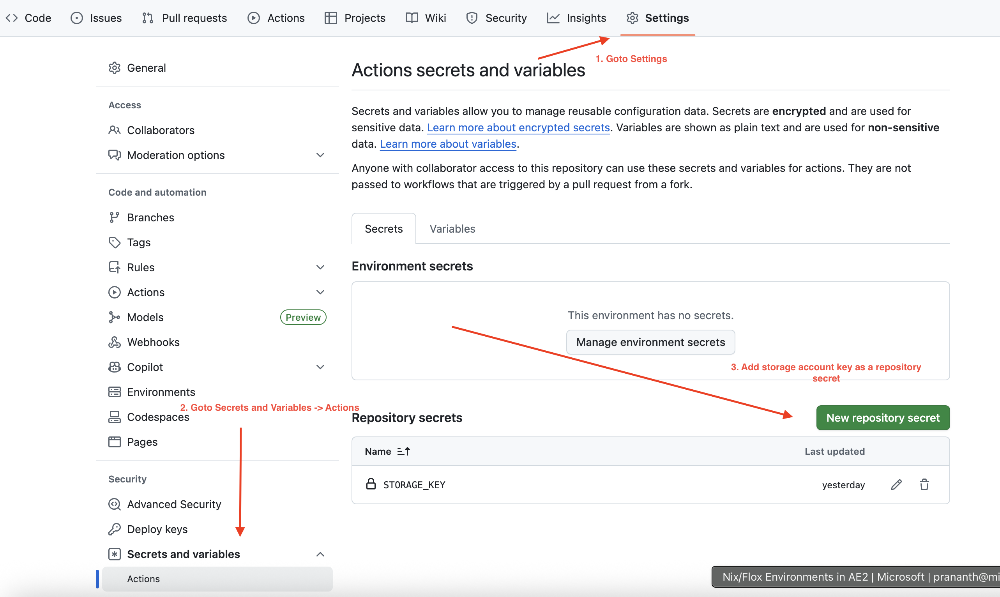
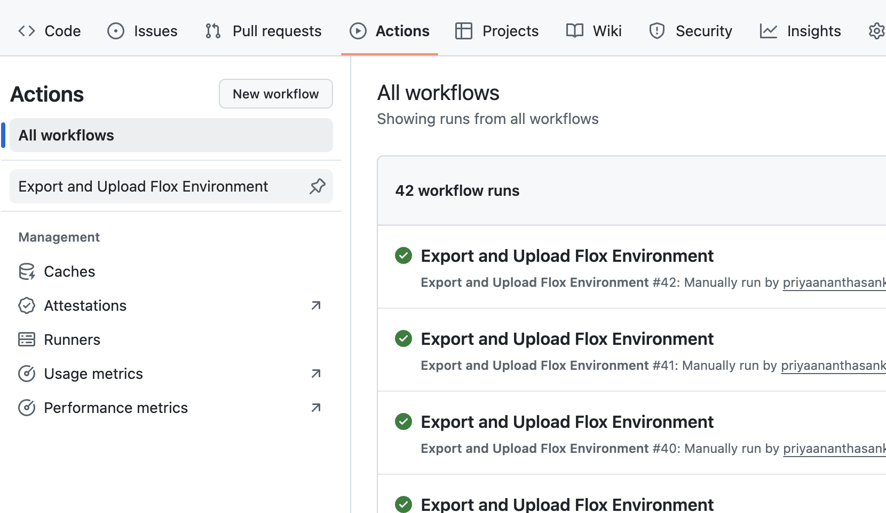
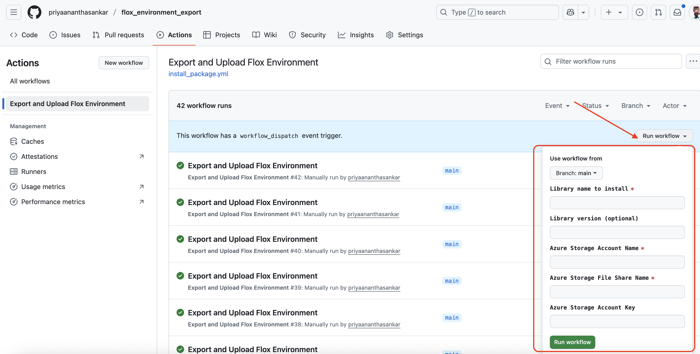

# Flox Environment Export

Easily export your Flox environment and upload it to Azure Storage for backup or sharing. This project provides scripts to automate the process, ensuring your development environments are reproducible and portable.

## Features

- **Export Flox Environments:** Package all relevant files and directories from a specified Flox environment.
- **Azure Upload:** Seamlessly upload exported environments to Azure File Shares for safe storage or collaboration.

## Prerequisites

- [Flox](https://floxdev.com/) installed and configured.
- [Azure CLI](https://learn.microsoft.com/en-us/cli/azure/install-azure-cli) installed and logged in.
- Access to an Azure Storage Account and File Share.

## GitHub Action

A sample GitHub Action workflow is provided in `.github/workflows/export-and-upload.yml` to automate exporting your Flox environment and uploading it to Azure; simply customize the workflow file with your environment and Azure credentials to use it in your CI/CD pipeline.

To run the GitHub Action, do the following:

- Fork the repo

- In your fork, navigate to the "Settings" tab  and configure Azure Storage Access Key 



- In your fork, navigate to the "Actions" tab in the repository and select the workflow.



 - Provide all the mandatory inputs and trigger the workflow by clicking `Run Workflow`

 

## Usage

### 1. Export a Flox Environment

```sh
./export_env.sh <env-name>
```

- `<env-name>`: Name of the Flox environment to export.

The script creates an `export/` directory containing the exported environment files.

### 2. Upload to Azure Storage

```sh
```sh
./upload_to_azure_storage.sh --export-folder <export_folder> --storage-account <storage_account> --file-share <file_share> --storage-key <storage_key> [--share-directory <share_directory>] [--overwrite]
```

- `--export-folder <export_folder>`: Path to the export directory from the previous step.
- `--storage-account <storage_account>`: Azure Storage Account name.
- `--file-share <file_share>`: Azure File Share name.
- `--storage-key <storage_key>`: Azure Storage Account key.
- `--share-directory <share_directory>`: (Optional) Directory within the file share to upload to. Defaults to `flox_environment`.

You must provide your Azure Storage Account Key as an argument.

## License

See [LICENSE](LICENSE) for details.

## Notes

- Ensure you have the necessary permissions for both Flox and Azure resources.
- Scripts include basic error checking and will exit if required arguments are missing or if operations fail.
- For troubleshooting, review script output and Azure CLI documentation.